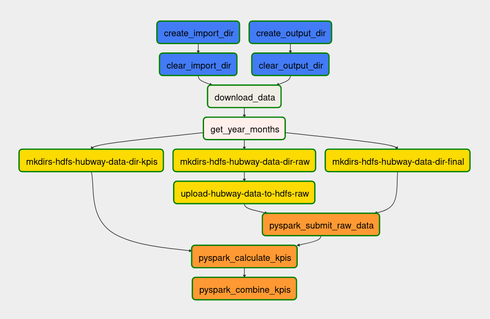

# Introduction

-   **Vorlesung:** Big Data
-   **Semester:** WiSe 22/23
-   **Dozent:** Marcel Mittelstädt

Projektabgabe für die Vorlesung _Big Data_ während des 5. Semesters an der DHBW Stuttgart. Dieses Projekt beschäftigt sich mit dem Konvertieren und Auswerten von einem [Datensatz](https://www.kaggle.com/datasets/acmeyer/hubway-data) eines **Bike-Sharing** Anbieters aus **Boston**.

# Installation

Um das Projekt auf Google Cloud VMs auszuführen, kann es simpler sein, das Git-Repository zu klonen. Dafür kann der folgende Befehl verwendet werden:

```bash
git clone git@github.com:felixhoffmnn/big-data.git
```

> **Note:** Bevor das Repository geklont werden kann, muss ein SSH-Key mit GitHub verknüpft werden.

Alternativ kann dieser Schritt auch mit `rsync` ersetzt werden. Hierfür könnte dieser [Guide](https://phoenixnap.com/kb/how-to-rsync-over-ssh) hilfreich sein.

Bevor der Workflow zum Konvertieren der Daten ausgeführt werden kann, ist es notwendig, **Hadoop** und **Airflow** zu starten. Hierfür werden die vorgegebenen Container verwendet. Falls dies auf einer GCP VM ausgeführt wird, muss zunächst Docker installiert werden ([Guide](https://docs.docker.com/engine/install/ubuntu/)).

```bash
docker compose up --build -d
```

Nachdem die Container gestartet haben, muss erst noch **Hadoop** gestartet werden. Dies geschieht jedoch innerhalb des `hadoop` Containers.

```bash
docker exec -it hadoop bash
sudo su hadoop
start-all.sh
```

Unter [http://localhost:8080/admin](http://localhost:8080/admin) sollte nun Airflow erreichbar sein. Hier können die einzelnen Dags ausgeführt werden.

# Konzept

Für einen leichteren Umgang verwendet dieses Projekt [Docker Compose](#docker-compose), um die benötigten Dateien direkt an die Container zu übergeben. Dadurch werden außerdem die finalen **KPIs** auch im Dateisystem des Nutzers gespeichert.



Nach dem Ausführen des `bike_dag` werden folgende Schritte ausgeführt:

1. **Erstellt** und/oder **leert** Verzeichnisse für den Download und die finalen KPIs
2. Lädt den Datensatz von _Kaggle_ herunter
3. Schaut, welche Dateien heruntergeladen wurden und **filtert** diese (**year months**) ([Funktionsbeschreibung](#year_months.py))
4. Erstellt partitionierte Ordner für jede `yyyymm` Kombination im _HDFS Filesystem_ für `raw`, `final` und `kpis` ([Funktionsbeschreibung](#bike_dag.py))
5. Kopiert die heruntergeladenen Daten in den `raw` Ordner auf das _HDFS Filesystem_ ([Funktionsbeschreibung](#bike_dag.py))
6. **Lädt** die `raw` Daten mittels _PySpark_ und führt Funktionen auf diesen aus und speichert diese letztlich im `final` Ordner auf dem _HDFS Filesystem_
    1. Iteriert über alle `yyyymm` Kombinationen, lädt anschließend die aktuelle Datei und benennt die Spalten um
    2. Gruppiert die Daten nach **latitude** und **longitude**, um anschließend die Entfernung für jede Kombination zu berechnen
    3. Joint die Entfernungen mit den initialen Daten, um die **trip distance** Spalte jedem Eintrag hinzuzufügen
    4. Berechnet die **generation**, **age** und **timeslot [0, 1, 2, 3]** ([Funktionsbeschreibung](#calculate_kpis.py))
    5. Nicht benötigte Spalten werden Fallen gelassen
    6. Speichert die Daten als `parquet` im `final` Ordner auf dem _HDFS Filesystem_
7. **Lädt** die Daten aus `final` mittels _PySpark_ in ein Dataframe und berechnet die **KPIs**
    1. Iteriert über alle `yyyymm` Kombinationen und lädt anschließend die aktuelle Datei
    2. Berechnet die **trip duration**, **trip distance**, **gender share**, **age share**, **generation share**, **top 10 bike ids**, **top 10 start stations**, **top 10 end stations** und **timeslot share**
    3. Erstellt einen Dataframe mit den berechneten Werten
    4. Speichert den Dataframe als `parquet` Datei im `kpis` Ordner
8. **Lädt** die Ergebnisse von dem _HDFS Filesystem_ in das Dateisystem des Nutzers in dem `data/output` Ordner

Die **Excel Datei** mit den zusammengefassten KPIs ist wie folgt aufgebaut:

| Spalte                 | Format                                                | Beschreibung                                            |
| ---------------------- | ----------------------------------------------------- | ------------------------------------------------------- |
| **year_month**         | `yyyymm`                                              | Kombination von Jahr und Monat der Daten in einer Zeile |
| **avg_trip_duration**  | `int`                                                 | Durchschnittliche Fahrtzeit in Minuten                  |
| **avg_trip_distance**  | `float`                                               | Durchschnittliche Fahrtentfernung in Kilometern         |
| **gender_share**       | `[("m", count), ("f", count), ("d", count)]`          | Anteil der Geschlechter an allen Fahrgästen             |
| **age_share**          | `[(age, count), (age, count), ...]`                   | Top 10 der meisten Altersgruppen und deren Anzahl       |
| **generation_share**   | `[(generation, count), (generation, count), ...]`     | Top 10 der Generationen und deren Anzahl                |
| **top_used_bikes**     | `[(bike_id, count), (bike_id, count), ...]`           | Top 10 der meistgenutzten Fahrräder und deren Anzahl    |
| **top_start_stations** | `[(station_name, count), (station_name, count), ...]` | Top 10 der häufigsten Startstationen und deren Anzahl   |
| **top_end_stations**   | `[(station_name, count), (station_name, count), ...]` | Top 10 der häufigsten Endstationen und deren Anzahl     |
| **timeslot**           | `[(0, count), (1, count), (2, count), (3, count)]`    | Anteil der Zeitslots an allen Fahrgästen                |

> **Note:** In der Datei `combined_kpis.csv` sind die KPIs für alle Monate zusammengefasst.

## Docker Compose

Das Docker Compose File ist in zwei Teile aufgeteilt. Zum einen wird der `spark_base` Container gestartet, welcher Hadoop und Hive beinhaltet. Zum anderen wird der `airflow` Container gestartet, welcher Airflow beinhaltet.

Um das `spark_base` Image kompatibel mit Docker Compose zu machen, ist es notwendig dies ein wenig zu verändern. Dies passiert durch `airflow.dockerfile` und `startup.sh`. Innerhalb der `airflow.dockerfile` werden zudem die benötigten Pythonpakete installiert. Die Dockerfile wird durch die Docker Compose gebaut. Anschließend werden die lokalen Ordner `dags` und `data` an den `airflow` Container gemountet.

## Funktionen

In diesem Abschnitt werden die primären Funktionen der wichtigsten Dateien erklärt.

### `bike_dag.py`

-   **create_local_import_dir**: Erstelle Ordner für den Download (`/home/airflow/bike_data`), wenn dieser nicht existiert
-   **create_output_dir**: Erstelle Ordner für die kombinierten KPIs (`/home/airflow/output`)
-   **clear_local_import_dir**: Löscht Kaggle-Datensatz von vorherigen Durchläufen
-   **clear_output_dir**: Löscht kombinierte KPIs aus vorherigen Durchläufen
-   **download_data**: Lädt den Datensatz von Kaggle herunter und speichert diesen in `/bike_data/`
-   **list_files**: Listet alle Dateien aus `/bike_data/` welche mit `yyyymm` anfangen
-   **create_hdfs_partition_raw**: Erstellt partitionierte Ordner (`/raw/{yyyymm}/`) für die `raw` Daten
-   **create_hdfs_partition_final**: Erstellt partitionierte Ordner (`final/{yyyymm}/`) für die `final` Daten
-   **create_hdfs_partition_kpis**: Erstellt partitionierte Ordner (`/kpis/{yyyymm}/`) für die `kpis` Daten
-   **copy_raw_to_hdfs**: Kopiert die `csv` Dateien von `/bike_data` nach `/kpis/{yyyymm}/`
-   **pyspark_calculate_kpis**: Optimiert und bereinigt die Rohdaten auf dem HDFS und verschiebt die `csv` Dateien von `raw` nach `final`
-   **pyspark_combine_kpis**: Fasst die partitionierten KPIs in einer Datei zusammen und speichert diese in den `output` Ordner

### `calculate_kpis.py`

-   **get_distance**: Berechnet die Distanz zwischen zwei Punkten auf der Basis von Latitude und Longitude
-   **get_age**: Berechnet das Alter eines Nutzers anhand des Geburtsjahres und des aktuellen Datums
-   **get_timeslot_helper**: Gibt einen Zeitslot zwischen `0` oder `3` zurück.
-   **get_timeslot**: Berechnet den Zeitslot eines Datums, basiert auf einem Start- und Enddatum und einem Zeitslot
-   **get_generation**: Gibt die Generation eines Nutzers zwischen `0`, `1`, `2`, `3`, `4`, und `5` zurück

> **Note:** Zunächst war geplant die Berechnung der Distanz mittels Google Maps vorzunehmen. Ansätze dafür sind auch noch vorhanden, jedoch erwies sich dies als sehr Zeitaufwendig.

### `year_months.py`

-   **get_year_months**: Gibt eine Liste von `yearmonth` Kombinationen zurück, basierend auf den Dateien in `/home/airflow/bike_data`

**Note:** Um den DAG zu beschleunigen, ist es am einfachsten, die Anzahl der zu verarbeitenden Monate zu begrenzen. Dies kann in dieser Datei eingestellt werden. Im folgenden Code wird ein Beispiel gezeigt, um die Anzahl an Monaten auf `3` zu begrenzen.

```python
# Function to get the year month list
def get_year_months():
    files = [file for file in os.listdir("/home/airflow/bike_data") if file[:6].isdigit()]

    # To reduce the number of files being processed, add a slice to the list
    return [file[:6] for file in files][:3]
```

## Datenbereinigung

Um die Qualität der Daten sicherzustellen, werden die Daten vor der Berechnung der KPIs bereinigt. Hierbei werden die folgenden Schritte ausgeführt:

1. `0 < trip_duration < 86400` (`0` - `24` Stunden)
2. `0 < age < 100`
3. `0 < generation` (`-1` repräsentiert einen Fehler)
4. `(0 < timeslot_[0 | 1 | 2 | 3]) & (timeslot_[0 & 1 & 2 & 3] != -1)` (`-1` repräsentiert einen Fehler)

# Probleme

1. In der Docker Compose werden einerseits Ordner wie `dags`, `python` und `output` gemountet. Bei letzterem kam es zu Problemen, da der Ordner nicht von einem lokalen Nutzer im Container erstellt wurde. Mittels des folgenden Befehls können die notwendigen Berechtigungen angepasst werden.

    ```bash
    sudo chmod 777 data/output/
    ```

2. Wenn die Docker Compose auf einem Windows Rechner ausgeführt wird, kann es dazu kommen, dass die `EOL` von `LF` sich auf `CRLF` ändert. Dies führt dazu, dass der `airflow` Container nicht starten kann.
